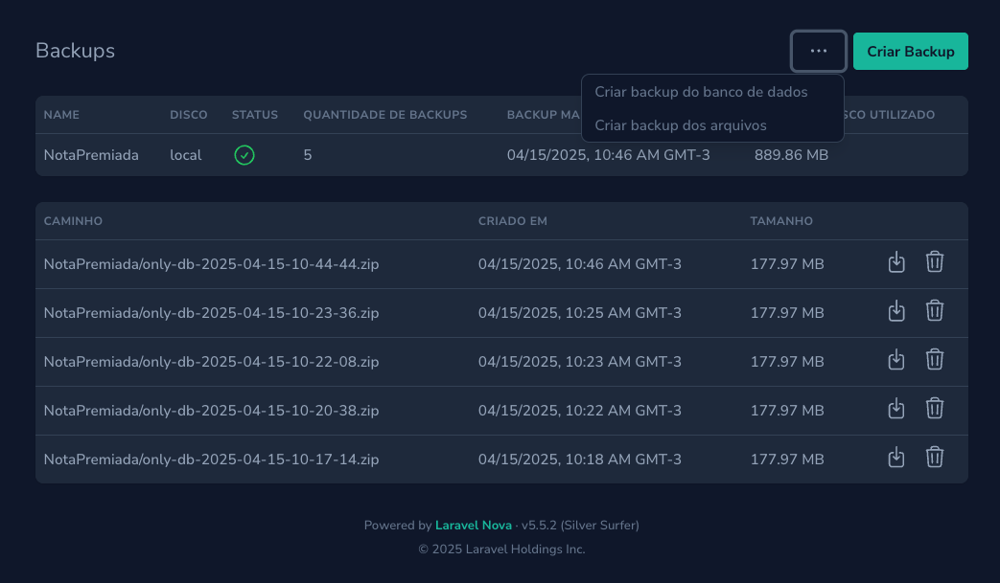
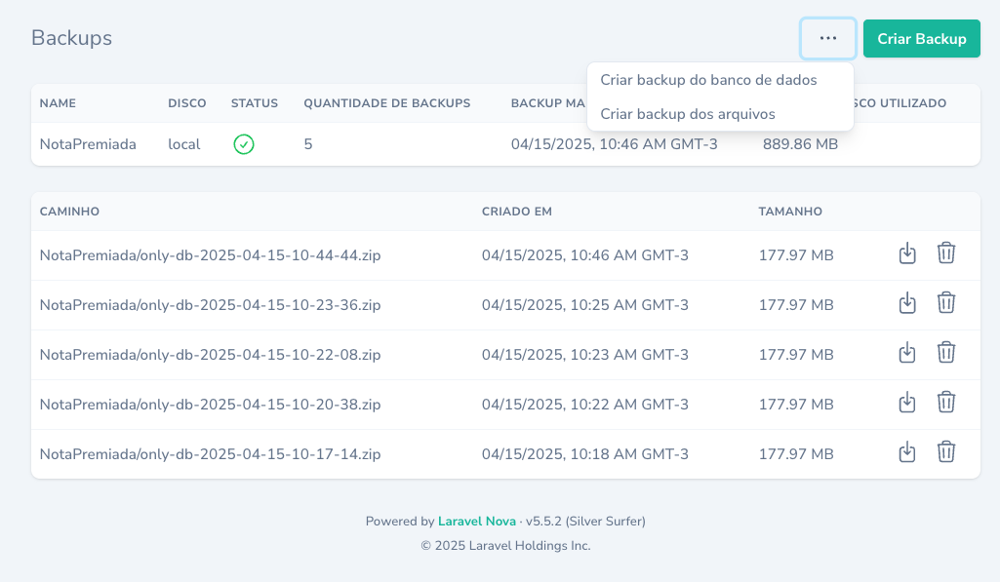

# Nova Backup Manager

A Laravel Nova 5 tool that allows administrators to manage application backups directly from the Nova interface.  
Create, download, monitor, and delete backups in a beautiful UI.

This tool uses Laravel's Cache system to improve performance when loading backup data. When scheduling backup jobs via Laravel's scheduler, it's recommended to clear the cache after successful execution:

```php
->onSuccess(function () {
    BackupCache::forgetBackupsConfig();
    BackupCache::forgetStatuses();
});
```

This ensures that the Nova UI always displays up-to-date backup information.

---

## 📦 Installation

Require the package via Composer:

```bash
  composer require diego-drese/nova-backup-manager
```

---

## 🔧 Register the Tool

In your `NovaServiceProvider` (or any custom Nova Tool registration), register the tool:

```php
public function tools()
{
    return [
        // ...
        new \DiegoDrese\NovaBackupManager\NovaBackupManager,
    ];
}
```

---

## ⚙️ Publish the Configuration File

To customize permissions and behavior, publish the config file:

```bash
  php artisan vendor:publish --tag=nova-backup-manager-config
```

This will create the file:  
`config/nova-backup-manager.php`

---

## ⚙️ Configuration Options

```php
return [
    'polling' => true,
    'polling_interval' => 10, // in seconds
    'queue' => null, // queue to dispatch backup jobs

    'show_menu' => true,
    'create' => true,
    'delete' => true,
    'download' => true,

    // Optional: dynamically resolve permissions per user
    'resolve_permissions' => null,
];
```

---

## 🛡️ Customize Per-user Permissions

To customize how permissions are evaluated per user, you can publish and customize the permission resolver:
```bash
  php artisan vendor:publish --tag=nova-backup-manager-permissions
```
This will create the file:

app/Nova/BackupPermissionResolver.php

This will override the static `show_menu`, `create`, `delete`, and `download` flags dynamically for each logged-in user.

In your config/nova-backup-manager.php, point to the resolver:

```bash
  'resolve_permissions' => [\App\Nova\BackupPermissionResolver::class, 'resolve'],

```

---

## 🖥️ Features

- Create full or partial (database/files only) backups
- List and download backups per disk
- Delete old backups
- Monitor disk health and status
- Live polling (configurable)

---

## 🖼️ UI Preview





---

## 📜 License

MIT © [Diego Drese](https://github.com/diego-drese)

